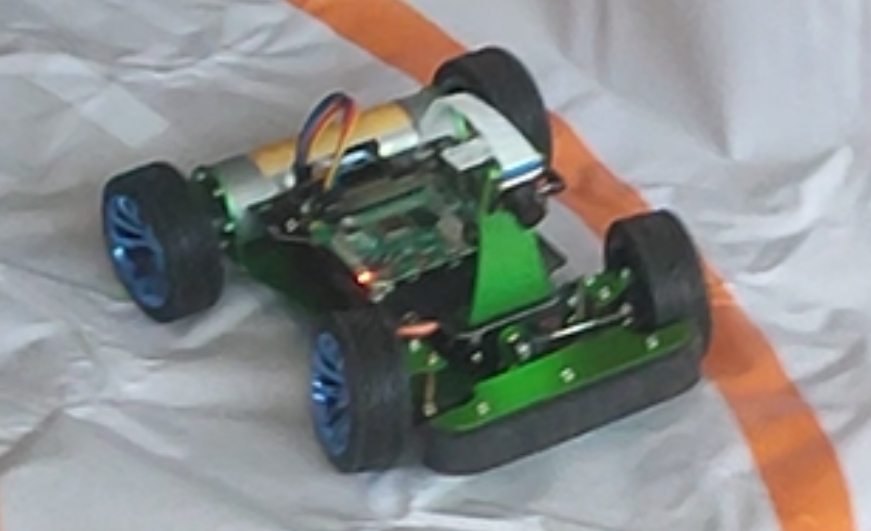
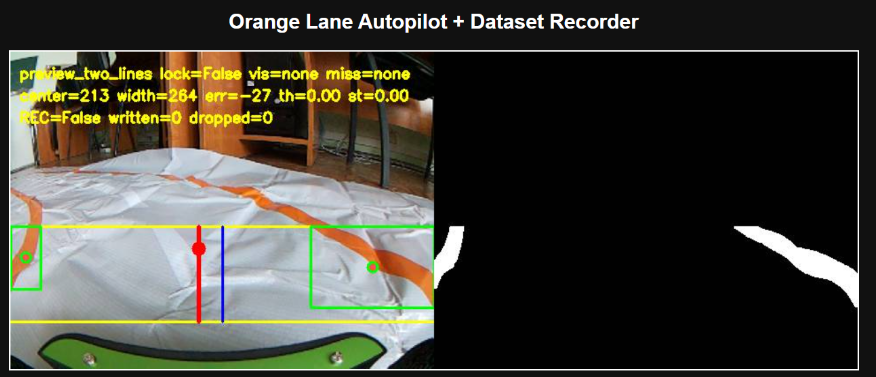

# Raspberry Pi Robot Car with Camera Streaming and Autopilot

A Raspberry Pi-based robot car project focused on camera streaming, FPV manual control, OpenCV-based autonomous driving, and machine learning autopilot experiments.

The project combines camera input, browser-based video monitoring, Python control logic, computer vision, dataset collection, model training, and motor/servo control.

## Overview

This repository contains project materials for a Raspberry Pi robot car setup.

The project includes three main software parts:

1. **FPV Manual Control** — manual control of the robot car with live camera video.
2. **OpenCV Autopilot** — computer vision-based driving using lane detection.
3. **ML Autopilot** — dataset collection, model training, and running a trained model on Raspberry Pi.

## Key Features

- Raspberry Pi camera capture using Picamera2
- MJPEG video streaming to a browser
- FPV manual control
- OpenCV-based line and lane detection
- Steering control based on camera image processing
- Dataset collection for machine learning
- Training a custom autopilot model
- Running a trained model on Raspberry Pi
- Motor and servo control integration
- Demonstration videos for FPV, OpenCV autopilot, and ML autopilot

## Technologies and Tools

- Raspberry Pi
- Python
- Picamera2
- OpenCV
- MJPEG streaming
- TensorFlow / Keras
- TensorFlow Lite
- Browser-based video stream
- Motor control
- Servo control
- Remote control logic

## System Architecture

```text
Pi Camera → Raspberry Pi → MJPEG Stream → Browser / Control Logic → Motor & Servo
```


## Project Structure

```text
donkeyCar_app_materials/
├── prepSteps/
├── finalStep/
│   ├── dataset/
│   └── models/
│
donkeyCar_demonstrations/
├── FPV/
├── openCV/
└── ml/
```

## Main Software Parts

### 1. FPV Manual Control

The FPV part is used for manual control of the robot car with live camera preview.

Main file:

```text
donkeyCar_app_materials/finalStep/fpv_record.py
```

This program handles:

- camera input
- live video stream
- manual driving control
- recording of demonstration videos

This part was used to test the basic camera stream, control behavior, and manual driving of the robot car.

### 2. OpenCV Autopilot

The OpenCV autopilot uses camera frames to detect lane lines and control the steering direction.

Main file:

```text
donkeyCar_app_materials/finalStep/opencv_autopilot_record.py
```

This program handles:

- receiving frames from the camera
- detecting one or two lane lines
- calculating the center of the driving path
- converting image processing results into steering commands
- recording OpenCV autopilot demonstrations

The OpenCV part includes both single-line following and two-line lane following experiments.

### 3. ML Autopilot

The machine learning autopilot is based on collecting training data, training a custom model, and running this model on the Raspberry Pi.

Main files:

```text
donkeyCar_app_materials/finalStep/data_recorder.py
donkeyCar_app_materials/finalStep/train_model.py
donkeyCar_app_materials/finalStep/ml_autopilot.py
```

File purposes:

- `data_recorder.py` — collects camera frames and corresponding manual control commands.
- `train_model.py` — trains a custom autopilot model using the collected dataset.
- `ml_autopilot.py` — runs the trained model on Raspberry Pi and controls the robot car based on model predictions.

The trained models are stored in:

```text
donkeyCar_app_materials/finalStep/models/
```

The dataset is stored in:

```text
donkeyCar_app_materials/finalStep/dataset/
```

## Development and Test Files

The `prepSteps/` folder contains test scripts used during the gradual development of the OpenCV autopilot.

```text
donkeyCar_app_materials/prepSteps/
```

Main test files:

- `orange_debug.py` — tests orange line detection from the camera.
- `orange_steering_test.py` — tests conversion of detected line position into steering commands.
- `lane_steering_roi_test.py` — tests steering based on a selected region of interest.
- `lane_two_contours_debug.py` — tests detection of two lane lines.
- `autopilot_follow.py` — intermediate OpenCV autopilot version for following one line.

These files are not the final programs, but they show the development and debugging process.

## Dataset and Models

The `dataset/` folder contains training images and control data used for model training.

```text
donkeyCar_app_materials/finalStep/dataset/
```

The `models/` folder contains trained models and training results.

```text
donkeyCar_app_materials/finalStep/models/
```

Model files include:

- `.tflite` models for running on Raspberry Pi
- `.keras` models for full Keras versions
- saved best model versions
- training loss and MAE plots
- preprocessing configuration files

Example model groups:

```text
manual_model.*
lane_model.*
```

## Demonstrations

Demo materials are stored in:
(https://drive.google.com/drive/folders/1VzoefyW_gy8uRJTU7gW_DrXXvEAA0x7D?usp=sharing)

## Images






## What This Project Demonstrates

This project demonstrates practical experience with Raspberry Pi-based robotics, camera streaming, Python scripting, OpenCV image processing, machine learning workflow, dataset collection, model training, and integration between software and physical motor/servo control.

## Project Materials

Full project files, screenshots, videos and documentation are available here:

[Open project folder](ADD_YOUR_GOOGLE_DRIVE_LINK_HERE)
